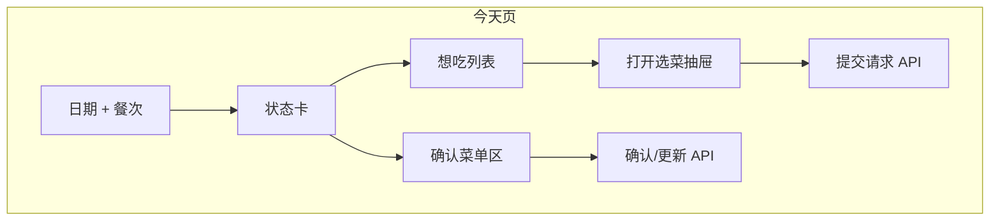

# 家庭点菜 · 界面与交互改版设计（待审核）

- **状态**：待审核（未进入开发）
- **日期**：2026-08-08
- **范围**：仅前端表现层与交互；**不改变** API、业务规则与信息架构（仍为一底栏四入口）
- **依据**：现有实现（`global.css` + 原生表单/按钮堆叠）与已批准产品规格 `2026-08-08-family-food-ordering-design.md`

---

## 1. 改版目标

| 目标 | 说明 | 可度量 |
| --- | --- | --- |
| **更像「产品」而非「原型」** | 卡片、层次、图标、空状态、加载态齐全 | 核心页无「裸 `<p>` 列表」 |
| **决策更快** | 「今天」首屏 3 秒内看懂：哪天、哪餐、谁点了啥、能否确认 | 保留产品指标：中位确认 ≤3 分钟 |
| **移动单手友好** | 主操作在拇指区；次要操作收入菜单/底部抽屉 | 主按钮距底栏 ≥16px 安全区 |
| **有家庭温度、不幼稚** | 暖色厨房感 + 大图菜品，避免卡通插画堆砌 | — |

**非目标**：不改四 Tab 结构；不增加社交/社区；不上 AI 对话式 UI；不做深色模式首版（可预留 token）。

---

## 2. 现状简要诊断

- **视觉**：已有暖橙 token，但页面多为标题 + 段落 + 默认按钮，**缺少卡片、间距节奏、字阶**。
- **导航**：底栏仅文字，无图标，激活态对比弱。
- **「今天」**：日期/午晚餐为平铺按钮；点菜、确认菜单与状态混在同一纵向流，**信息优先级不清**。
- **「菜品」**：列表像数据库行；筛选为原生 `<select>`；新建/编辑表单长页展开，打断浏览。
- **「帮我选」**：随机结果与食材匹配为文章块，**缺少「揭晓时刻」与筛选可视化**。
- **反馈**：错误用 `role="alert"` 段落；成功无 toast；加载仅「正在加载…」。
- **图片**：有上传能力但列表/卡片未统一展示缩略图比例与占位。

---

## 3. 设计方向：「暖光餐桌」

### 3.1 气质关键词

温馨 · 利落 · 食物优先 · 家庭协作（多人痕迹可见）

### 3.2 视觉语言

**色彩**（在现有 token 上扩展，不推翻品牌橙）：

| Token | 用途 | 建议值 |
| --- | --- | --- |
| `--color-bg` | 页面底 | `#FFFBF7` |
| `--color-surface` | 卡片面 | `#FFFFFF` |
| `--color-surface-raised` | 浮层/底栏 | `rgba(255,255,255,0.92)` |
| `--color-brand` | 主色 CTA | `#C2410C`（略提饱和，仍暖） |
| `--color-brand-soft` | 选中底、标签 | `#FFEDD5` |
| `--color-ink` | 主文字 | `#292524` |
| `--color-muted` | 次要 | `#78716C` |
| `--color-success` | 已确认 | `#047857` |
| `--color-warning` | 草稿/待确认 | `#B45309` |
| `--shadow-sm` | 卡片 | `0 1px 3px rgba(28,25,23,0.08)` |

**字体**：保留中文系统栈；引入明确字阶：

- Display（页面标题）：22–24px / semibold  
- Title（卡片标题）：17–18px / semibold  
- Body：15–16px / regular  
- Caption：13px / muted  

**圆角与间距**：卡片 `12px`；主按钮 `12px`；页面水平边距 `16px`；卡片内 `12–16px`；区块间距 `20–24px`。

**图标**：底栏与关键操作使用 **单色线性图标**（建议 Lucide 或内联 SVG，约 22px），与文字并排，避免 emoji 作为主图标。

### 3.3 布局骨架

```text
┌─────────────────────────────┐
│ [可选] 顶栏：家庭名 / 页标题   │  ← 登录后内页统一 AppHeader
├─────────────────────────────┤
│                             │
│   主内容（max-width 40rem）   │
│                             │
├─────────────────────────────┤
│  🏠今天  🍲菜品  ✨帮我选  👪家庭 │  ← 图标+文案，激活：品牌色+浅底 pill
└─────────────────────────────┘
```

- 新增 **`AppHeader`**：左侧页面标题或上下文（如「今天」），右侧可放轻量操作（如「菜品」页的「+」）。
- 底栏高度保持 ≥64px + safe-area；激活项为 **圆角 pill 背景**，非整格变色。

---

## 4. 组件体系（CSS 策略）

在不大改构建的前提下：

1. **`styles/tokens.css`**：设计 token  
2. **`styles/components/*.css`** 或 BEM 类：`card`, `chip`, `segmented`, `bottom-sheet`, `toast`, `skeleton`  
3. **不引入** Tailwind / 重型 UI 库（控制包体与 PWA）；可选 **@radix-ui/react-dialog** 仅用于底部抽屉无障碍（若你同意再加依赖）

| 组件 | 行为 |
| --- | --- |
| **Card** | 白底、浅阴影、可选左侧 4px 状态色条（草稿/已确认） |
| **Chip / FilterChip** | 类别、餐次、食材多选 |
| **SegmentedControl** | 午餐/晚餐、创建/加入 Tab |
| **DishCard** | 图（4:3）+ 名 + 类别 chip + 制作者头像字母 |
| **MemberAvatar** | 昵称首字圆形，用于「谁点的」 |
| **BottomSheet** | 新建/编辑菜品、确认菜单前的预览 |
| **Toast** | 成功/轻错误，3s 自动消失 |
| **Skeleton** | 列表与首屏占位 |
| **EmptyState** | 插图（简单 SVG）+ 一句引导 + 主按钮 |

---

## 5. 分页面交互方案

### 5.1  onboarding（创建/加入家庭）

**问题**：两表单上下堆叠，像设置页。

**方案**：

- 顶部 **品牌区**：产品名 + 一句价值「少争论，快点菜」。
- **分段控件**：`创建家庭` | `加入家庭`，只显示一个表单。
- 表单：**标签在上、输入框全宽**；PIN 使用 `inputmode="numeric"` + 等宽数字框视觉。
- 创建成功：**全屏结果卡**展示邀请码（大字号、可复制按钮），再进入主应用。
- 错误：字段下方 inline + 顶部 toast（严重错误）。

### 5.2 今天（核心）

**信息分层（自上而下）**：

1. **Sticky 控制条**（滚动时吸顶，低于离线 banner）  
   - 日期：中间 `3月8日 周六`，两侧 chevron；点击日期可弹 **简易日历条**（先实现左右切换，日历为二期可选）。  
   - 其下：**午餐 | 晚餐** SegmentedControl。

2. **状态卡**（一张 Card）  
   - 左：状态徽章 `草稿` / `已确认`（颜色区分）  
   - 右：若已确认，显示「最后修改 · 昵称 · 相对时间」

3. **「想吃」区**  
   - 标题 + 人数角标  
   - 列表：**按菜品聚合**（同一道菜多人点显示多个小头像叠放 + 「×2」）  
   - 底部主按钮：**+ 想吃的菜** → 打开 **BottomSheet**：搜索 + 菜品卡片网格（带图），点选即提交  
   - 当前用户自己的请求：卡片上 **撤回**（文字按钮，非主色）

4. **「确认菜单」区**  
   - 与请求区分隔（分隔线或浅色背景块）  
   - `MenuEditor` 改为：**可拖拽排序的菜单列表**（首版可先做上下箭头排序，降低实现成本）  
   - 固定底栏 **「确认菜单（N 道）」** 主按钮；已确认后变为 **「更新菜单」** 次要样式  
   - 版本冲突：toast + 自动刷新（保留现有逻辑）



### 5.3 菜品

- 顶栏：**搜索框**（本地 filter 菜名，不必后端）+ 筛选图标打开 **BottomSheet**（制作者、类别 Chip）。  
- 列表：**DishCard 双列网格**（窄屏 1 列，≥360px 2 列）；归档入口收到长按或卡片菜单「⋯」。  
- **新建**：右下角 **FAB** 或顶栏「+」→ BottomSheet 表单（与 `DishForm` 字段一致，分区：基本信息 / 谁会做 / 食材 / 图片）。  
- 编辑：同 Sheet，保存后 toast。

### 5.4 帮我选

- 顶部 **Tab**：`随机一道` | `按食材找`（同页减少纵向长度）。  
- **随机**：  
  - 筛选条件以 **可横滑的 Chip 行** 展示（制作者、类别）  
  - 主区域：**大卡片占位** → 点击 **「帮我选」** 按钮后 **翻牌/淡入动画** 展示结果（固定种子 e2e 仍可测）  
  - 结果卡：大图 + 主按钮「加入今晚点菜」  
- **食材**：`IngredientPicker` 改为 **标签云 + 已选条**；结果分 **全匹配 / 缺一样** 两组，用不同色左边条。

### 5.5 家庭

- 顶部 **当前成员卡**（头像 + 昵称 + 退出）。  
- **邀请码**：仅创建者可见，卡片 + 复制 + 刷新（危险操作用二次确认 dialog）。  
- **成员列表**：行内头像 + 状态点。  
- **历史菜单**：时间线样式（日期 → 餐次 pill → 菜名快照列表）；点击进入只读详情（首版可保持行展开）。

### 5.6 全局

- **离线 banner**：保持 sticky；样式改为细条，不抢主内容。  
- **加载**：列表 skeleton；按钮内 loading spinner。  
- **动效**：150–200ms ease；尊重 `prefers-reduced-motion`。  
- **无障碍**：保留 `aria-pressed`、焦点环；BottomSheet 焦点陷阱。

---

## 6. 技术实施计划（审核通过后）

| 阶段 | 内容 | 风险 |
| --- | --- | --- |
| **P0 基础** | tokens、AppHeader、底栏图标、Card/Chip/Segmented/Toast/Skeleton | 低 |
| **P1 今天** | 吸顶控制条、选菜 BottomSheet、状态卡、确认底栏 | 中（需改 `MealRequests`/`MenuEditor` 结构） |
| **P2 菜品** | 网格、搜索、Sheet 表单 | 中 |
| **P3 帮我选 + 家庭** | Tab、随机动画、历史时间线 | 低–中 |
| **P4** | 快照更新、E2E 选择器、视觉回归（可选 Playwright screenshot） | 测试维护 |

**测试策略**：现有 e2e 以 role/文案为主，改版后同步 `data-testid` 关键路径（邀请码、确认菜单、随机加入）。

**依赖**：默认 **不新增** npm 依赖；若你同意底部抽屉无障碍，再单独加 `@radix-ui/react-dialog`。

---

## 7. 需要你拍板的选项

请在审核时勾选或回复编号，开发将严格按你的选择执行。

1. **整体风格**  
   - [ ] **A. 暖光餐桌**（上文默认：白卡片 + 暖橙）  
   - [ ] **B. 更极简**：更少阴影、更多留白、接近 iOS 系统风  
   - [ ] **C. 更浓郁**：更深背景、卡片对比更强（仍单浅色主题）

2. **菜品列表密度**  
   - [ ] **双列网格**（默认）  
   - [ ] **单列大图**（更像菜谱 App）

3. **表单交互**  
   - [ ] **BottomSheet**（默认，适合手机）  
   - [ ] **独立全屏页**（实现更简单，但多一次路由）

4. **图标方案**  
   - [ ] 内联 SVG / 本地图标集（零依赖）  
   - [ ] Lucide React（依赖小、一致性好）

5. **菜单排序**  
   - [ ] 首版仅 **上下箭头** 调序  
   - [ ] 首版即 **拖拽排序**（需 touch DnD 库）

---

## 8. 审核结论（由你填写）

- [ ] **批准**，按 P0→P4 开发  
- [ ] **修改后批准**（请注明章节）  
- [ ] **暂缓**

**备注**：

---

*文档版本：v0.1 · 仅设计，不含代码变更*
